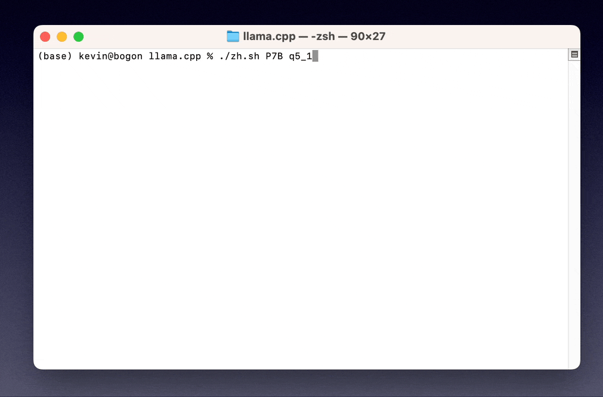
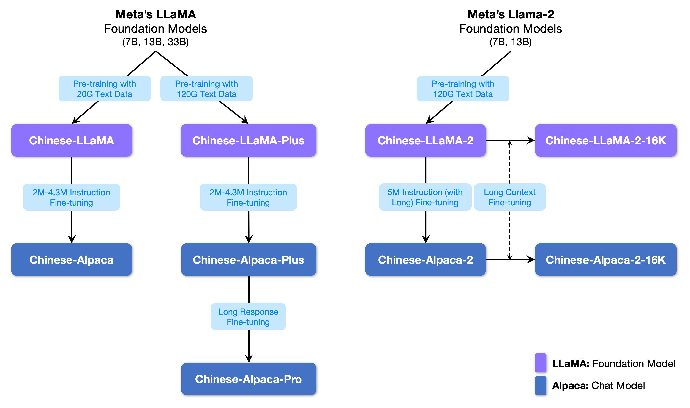

# [Chinese-LLaMA-Alpaca-2 v4.0](https://github.com/ymcui/Chinese-LLaMA-Alpaca-2) released long context LLMs (64K) and RLHF-tuned LLMs

[**🇨🇳中文**](./README.md) | [**🌐English**](./README_EN.md) | [**📖文档/Docs**](https://github.com/ymcui/Chinese-LLaMA-Alpaca/wiki) | [**❓提问/Issues**](https://github.com/ymcui/Chinese-LLaMA-Alpaca/issues) | [**💬讨论/Discussions**](https://github.com/ymcui/Chinese-LLaMA-Alpaca/discussions) | [**⚔️竞技场/Arena**](http://chinese-alpaca-arena.ymcui.com/)

<p align="center">
    <br>
    
    <br>
</p>
<p align="center">
    
    
    
    
    <a href="https://app.codacy.com/gh/ymcui/Chinese-LLaMA-Alpaca/dashboard?utm_source=gh&utm_medium=referral&utm_content=&utm_campaign=Badge_grade"></a>
</p>


To promote open research of large models in the Chinese NLP community, this project has open-sourced the **Chinese LLaMA model and the Alpaca large model with instruction fine-tuning**. These models expand the Chinese vocabulary based on the original LLaMA and use Chinese data for secondary pre-training, further enhancing Chinese basic semantic understanding. Additionally, the project uses Chinese instruction data for fine-tuning on the basis of the Chinese LLaMA, significantly improving the model's understanding and execution of instructions.

**Technical Report (V2)**：[[Cui, Yang, and Yao, 2023] Efficient and Effective Text Encoding for Chinese LLaMA and Alpaca](https://arxiv.org/abs/2304.08177)

**Main contents of this project:**

- 🚀 Extended Chinese vocabulary on top of original LLaMA with significant encode/decode efficiency
- 🚀 Open-sourced the Chinese LLaMA (general purpose) and Alpaca (instruction-tuned) 
- 🚀 Open-sourced the pre-training and instruction finetuning (SFT) scripts for further tuning on user's data
- 🚀 Quickly deploy and experience the quantized version of the large model on CPU/GPU of your laptop (personal PC)
- 🚀 Support [🤗transformers](https://github.com/huggingface/transformers), [llama.cpp](https://github.com/ggerganov/llama.cpp), [text-generation-webui](https://github.com/oobabooga/text-generation-webui), [LlamaChat](https://github.com/alexrozanski/LlamaChat), [LangChain](https://github.com/hwchase17/langchain), , [privateGPT](https://github.com/imartinez/privateGPT), etc.
- Released versions: 7B (basic, **Plus**, **Pro**), 13B (basic, **Plus**, **Pro**), 33B (basic, **Plus**, **Pro**)

💡 The following image shows the actual experience effect of the 7B version model after local deployment (animation unaccelerated, tested on Apple M1 Max).



----

[**Chinese-LLaMA-Alpaca-2**](https://github.com/ymcui/Chinese-LLaMA-Alpaca-2)| [Visual Chinese-LLaMA-Alpaca](https://github.com/airaria/Visual-Chinese-LLaMA-Alpaca) | [Multi-modal VLE](https://github.com/iflytek/VLE) | [Chinese MiniRBT](https://github.com/iflytek/MiniRBT) | [Chinese LERT](https://github.com/ymcui/LERT) | [Chinese-English PERT](https://github.com/ymcui/PERT) | [Chinese MacBERT](https://github.com/ymcui/MacBERT) | [Chinese ELECTRA](https://github.com/ymcui/Chinese-ELECTRA) | [Chinese XLNet](https://github.com/ymcui/Chinese-XLNet) | [Chinese BERT](https://github.com/ymcui/Chinese-BERT-wwm) | [Knowledge distillation tool TextBrewer](https://github.com/airaria/TextBrewer) | [Model pruning tool TextPruner](https://github.com/airaria/TextPruner)

## News

**[Aug 14, 2023] Chinese-LLaMA-Alpaca-2 v2.0 released. We open-source Chinese-LLaMA-2-13B and Chinese-Alpaca-2-13B. See https://github.com/ymcui/Chinese-LLaMA-Alpaca-2**

[July 19, 2023] [Release v5.0](https://github.com/ymcui/Chinese-LLaMA-Alpaca/releases/tag/v5.0): Release Alpaca-Pro models, significantly improve generation quality. Along with Plus-33B models.

[July 19, 2023] We are launching [Chinese-LLaMA-Alpaca-2 project](https://github.com/ymcui/Chinese-LLaMA-Alpaca-2).

[July 10, 2023] Beta channel preview, know coming updates in advance. See [Discussion](https://github.com/ymcui/Chinese-LLaMA-Alpaca/discussions/732)

[July 7, 2023] The Chinese-LLaMA-Alpaca family welcomes a new member: [Visual Chinese-LLaMA-Alpaca model](https://github.com/airaria/Visual-Chinese-LLaMA-Alpaca) for visual question answering and chat. The 7B test version is available.

[June 30, 2023] 8K context support with llama.cpp. See [Discussion](https://github.com/ymcui/Chinese-LLaMA-Alpaca/discussions/696). For 4K+ context support with transformers, see [PR#705](https://github.com/ymcui/Chinese-LLaMA-Alpaca/pull/705).

[June 16, 2023] [Release v4.1](https://github.com/ymcui/Chinese-LLaMA-Alpaca/releases/tag/v4.1): New technical report, add C-Eval inference script, add low-resource model merging script, etc.

[June 8, 2023] [Release v4.0](https://github.com/ymcui/Chinese-LLaMA-Alpaca/releases/tag/v4.0): LLaMA/Alpaca 33B versions are available. We also add privateGPT demo, C-Eval results, etc.

## Content Navigation

| Chapter                                       | Description                                                  |
| --------------------------------------------- | ------------------------------------------------------------ |
| [Download](#Model-Download)                         | Download links for Chinese LLaMA and Alpaca                  |
| [Model Reconstruction](#Model-Reconstruction) | (Important) Explains how to merge downloaded LoRA models with the original LLaMA |
| [Quick Deployment](#Quick-Deployment)         | Steps for quantize and deploy LLMs on personal computers     |
| [Example Results](#System-Performance)           | Examples of the system output                                |
| [Training Details](#Training-Details)         | Introduces the training details of Chinese LLaMA and Alpaca  |
| [FAQ](#FAQ)                                   | Replies to some common questions                             |
| [Limitations](#Limitations)                    | Limitations of the models involved in this project           |

## Model Download

### ⚠️ User Notice (Must Read)

The official [LLaMA models released by Facebook prohibit commercial use](https://github.com/facebookresearch/llama), and the official model weights have not been open-sourced (although there are many third-party download links available online). In order to comply with the relevant licenses, it is currently not possible to release the complete model weights. We appreciate your understanding. After Facebook fully opens up the model weights, this project will update its policies accordingly. **What is released here are the LoRA weights**, which can be seen as a "patch" for the original LLaMA model, and the complete weights can be obtained by merging the two.

### Model Overview

The following figure depicts all open-sourced models for our projects (including the [second-gen project](https://github.com/ymcui/Chinese-LLaMA-Alpaca-2)).



### Which model should I use?

The following table provides a basic comparison of the Chinese LLaMA and Alpaca models, as well as recommended usage scenarios (including, but not limited to). 

💡 **Plus versions** are trained on more data, which is highly recommended for use.

| Comparison Item                                        | Chinese LLaMA                                                | Chinese Alpaca                                               |
| ------------------------------------------------------ | ------------------------------------------------------------ | ------------------------------------------------------------ |
| Training Method                                        | Traditional CLM (trained on general corpus)                  | Instruction Fine-tuning (trained on instruction data)        |
| Model Type                                             | Base model                                                   | Instruction-following model (like ChatGPT)                   |
| Training Data                                          | unsupervised free text                                       | supervised instruction data                                  |
| Vocab size<sup>[3]</sup>                               | 4995**3**                                                    | 4995**4**=49953+1 (pad token)                                |
| Input Template                                         | Not required                                                 | Must meet template requirements<sup>[1]</sup>                |
| Suitable Scenarios ✔️                                   | Text continuation: Given a context, let the model continue writing | 1. Instruction understanding (Q&A, writing, advice, etc.)<br/>2. Multi-turn context understanding (chat, etc.) |
| Unsuitable Scenarios ❌                                 | Instruction understanding, multi-turn chat, etc.             | Unrestricted free text generation                            |
| llama.cpp                                              | Use `-p` parameter to specify context                        | Use `-ins` parameter to enable instruction understanding + chat mode |
| text-generation-webui                                  | Not suitable for chat mode                                   | Use `--cpu` to run without a GPU; if not satisfied with generated content, consider modifying prompt |
| LlamaChat                                              | Choose "LLaMA" when loading the model                        | Choose "Alpaca" when loading the model                       |
| [inference_hf.py](./scripts/inference/inference_hf.py) | No additional startup parameters required                    | Add `--with_prompt` parameter when launching                 |
| [web-demo](./scripts/inference/gradio_demo.py)         | Not applicable                                               | Simply provide the Alpaca model location; support multi-turn conversations |
| [LangChain-demo](./scripts/langchain) / privateGPT     | Not applicable                                               | Simply provide the Alpaca model location                     |
| Known Issues                                           | If not controlled for termination, it will continue writing until reaching the output length limit.<sup>[2]</sup> | Please use Pro models to avoid short responses (in Plus series). |

*[1] Templates are built-in for (llama.cpp/LlamaChat/[inference_hf.py](./scripts/inference/inference_hf.py)/[web-demo](./scripts/inference/gradio_demo.py)/[LangChain-demo](./scripts/langchain).*

*[2] If you encounter issues such as low-quality model responses, nonsensical answers, or failure to understand questions, please check whether you are using the correct model and startup parameters for the scenario.*

*[3] Alpaca model has an additional pad token in vocabulary than LLaMA. **Please do not mix LLaMA/Alpaca tokenizers**.*


### Recommended Models

Below is a list of models recommended for this project. These models typically use more training data and optimized model training methods and parameters, so they should be used preferentially (for other models, please check [Other Models](#Other-Models)). **If you want to experience ChatGPT-like interaction, please use the Alpaca model instead of the LLaMA model.** For Alpaca models, please use Pro versions for longer responses. If you prefer shorter response, please use Plus series instead.

| Model                   |            Type             |       Data       |         Required Original Model<sup>[1]</sup>          | Size<sup>[2]</sup> |                 Download Links<sup>[3]</sup>                 |
| :---------------------- | :-------------------------: | :--------------: | :----------------------------------------------------: | :----------------: | :----------------------------------------------------------: |
| Chinese-LLaMA-Plus-7B  | base model | general 120G |        LLaMA-7B         |        790M        | [[BaiduDisk]](https://pan.baidu.com/s/1zvyX9FN-WSRDdrtMARxxfw?pwd=2gtr)</br>[[Google Drive]](https://drive.google.com/file/d/1N97m3rBj-rp-J1X8rgRfluyomEscfAq0/view?usp=sharing) |
| Chinese-LLaMA-Plus-13B | base model | general 120G |        LLaMA-13B        |        1.0G        | [[BaiduDisk]](https://pan.baidu.com/s/1VGpNlrLx5zHuNzLOcTG-xw?pwd=8cvd)<br/>[[Google Drive]](https://drive.google.com/file/d/1q0L5Me_1j_9iiRRNfuEFUt3SOjQo3-g3/view?usp=share_link) |
| Chinese-LLaMA-Plus-33B 🆕 | base model | general 120G | LLaMA-33B | 1.3G<sup>[6]</sup> | [[BaiduDisk]](https://pan.baidu.com/s/1v2WsSA0RFyVfy7FXY9A2NA?pwd=n8ws)<br/>[[Google Drive]](https://drive.google.com/file/d/1S4pBPiIZo7fXqf8hjnFaeE7Z-yZFEta9/view?usp=share_link) |
| Chinese-Alpaca-Pro-7B 🆕 | instruction-following model | instruction 4.3M | *LLaMA-7B &<br/>LLaMA-Plus-7B*<sup>[4]</sup> | 1.1G | [[BaiduDisk]](https://pan.baidu.com/s/1M7whRwG5DRRkzRXCH4aF3g?pwd=fqpd)<br/>[[Google Drive]](https://drive.google.com/file/d/1yfIJ2IXymaTaJ8l7VMnb5LnvQFx3idh-/view?usp=share_link) |
| Chinese-Alpaca-Pro-13B 🆕 | instruction-following model | instruction 4.3M | *LLaMA-13B &<br/>LLaMA-Plus-13B<sup>[4]</sup>* | 1.3G | [[BaiduDisk]](https://pan.baidu.com/s/1ok5Iiou-MovZa7bFLvt4uA?pwd=m79g)<br/>[[Google Drive]](https://drive.google.com/file/d/1IY8PzMje1LM2bIgnniArnmmE8qYaJV_I/view?usp=share_link) |
| Chinese-Alpaca-Pro-33B 🆕 | instruction-following model | instruction 4.3M | *LLaMA-33B &<br/>LLaMA-Plus-33B<sup>[4]</sup>* | 2.1G | [[BaiduDisk]](https://pan.baidu.com/s/1u2TWZcsG_PZSTnmuu7vwww?pwd=8zj8)<br/>[[Google Drive]](https://drive.google.com/file/d/14sFEhRq9c-p8S_TiVYNBnmPr4hk-nhs-/view?usp=share_link) |

**[1]** The original LLaMA model needs to be applied for use in [Facebook-LLaMA](https://github.com/facebookresearch/llama) or refer to this [PR](https://github.com/facebookresearch/llama/pull/73/files). Due to copyright issues, this project cannot provide downloads, and we ask for your understanding.

**[2]** The reconstructed model is slightly larger than the original LLaMA (due to the expanded vocabulary); the 7B model is about 13G+.

**[3]** After downloading, be sure to check whether the SHA256 of the ZIP file is consistent; for the full value, please see [SHA256.md](./SHA256.md).

**[4]** Merging steps for Alpaca-Plus are different from others, please refer to [wiki](https://github.com/ymcui/Chinese-LLaMA-Alpaca/wiki/Manual-Conversion#multiple-lora-weights-merging-applicable-to-chinese-alpaca-plus).

**[5]** Also known as 30B model in elsewhere. There was a naming typo in release this model by Facebook. We stick to their original paper naming convention here (and also the actual numbers of weights).

**[6]** Stored in FP16.

The file directory inside the ZIP file is as follows (using Chinese-LLaMA as an example):

```
chinese_llama_lora_7b/
  - adapter_config.json       # LoRA weight configuration file
  - adapter_model.bin         # LoRA weight file
  - special_tokens_map.json   # special_tokens_map file
  - tokenizer_config.json     # tokenizer configuration file
  - tokenizer.model           # tokenizer file
```

### Other Models

Due to factors such as training methods and training data, **the models below are no longer recommended (they may still be useful in specific scenarios)**. Please preferentially use the [recommended models](#Recommended-Models) in the previous section.

| Model              |            Type             |      Data      | Required Original Model<sup>[1]</sup> | Size<sup>[2]</sup> |                 Download Links<sup>[3]</sup>                 |
| :----------------- | :-------------------------: | :------------: | :-----------------------------------: | :----------------: | :----------------------------------------------------------: |
| Chinese-LLaMA-7B  | Base model | general 20G  |      LLaMA-7B      |        770M        | [[BaiduDisk]](https://pan.baidu.com/s/1oORTdpr2TvlkxjpyWtb5Sw?pwd=33hb)</br>[[Google Drive]](https://drive.google.com/file/d/1iQp9T-BHjBjIrFWXq_kIm_cyNmpvv5WN/view?usp=sharing) |
| Chinese-LLaMA-13B | Base model | general 20G  |     LLaMA-13B      |        1.0G        | [[BaiduDisk]](https://pan.baidu.com/s/1BxFhYhDMipW7LwI58cGmQQ?pwd=ef3t)<br/>[[Google Drive]](https://drive.google.com/file/d/12q9EH4mfKRnoKlbkkhzv1xDwWnroo9VS/view?usp=sharing) |
| Chinese-LLaMA-33B | Base model | general 20G | LLaMA-33B | 2.7G | [[BaiduDisk]](https://pan.baidu.com/s/1-ylGyeM70QZ5vbEug5RD-A?pwd=hp6f)<br/>[[Google Drive]](https://drive.google.com/file/d/1NwsLYbuEByUxre5GqTN5EkxiuZSRxUy_/view?usp=share_link) |
| Chinese-Alpaca-7B         | Instruction-following model |  instruction 2M  |                        LLaMA-7B                        |        790M        | [[BaiduDisk]](https://pan.baidu.com/s/1xV1UXjh1EPrPtXg6WyG7XQ?pwd=923e)</br>[[Google Drive]](https://drive.google.com/file/d/1JvFhBpekYiueWiUL3AF1TtaWDb3clY5D/view?usp=sharing) |
| Chinese-Alpaca-13B        | Instruction-following model |  instruction 3M  |                       LLaMA-13B                        |        1.1G        | [[BaiduDisk]](https://pan.baidu.com/s/1wYoSF58SnU9k0Lndd5VEYg?pwd=mm8i)<br/>[[Google Drive]](https://drive.google.com/file/d/1gzMc0xMCpXsXmU1uxFlgQ8VRnWNtDjD8/view?usp=share_link) |
| Chinese-Alpaca-33B | Instruction-following model | instruction 4.3M | LLaMA-33B | 2.8G | [[BaiduDisk]](https://pan.baidu.com/s/1fey7lGMMw3GT982l8uJYMg?pwd=2f2s)<br/>[[Google Drive]](https://drive.google.com/file/d/1YeSgnZWaRkKdmYa-JHiIlcvqhrDd4-Y4/view?usp=share_link) |
| Chinese-Alpaca-Plus-7B  | Instruction-following model |  instruction 4M  |  *LLaMA-7B &<br/>LLaMA-Plus-7B*  |        1.1G        | [[BaiduDisk]](https://pan.baidu.com/s/12tjjxmDWwLBM8Tj_7FAjHg?pwd=32hc)</br>[[Google Drive]](https://drive.google.com/file/d/1EDcTmq6tDmRxqarpapdyDGBE9opY0zrB/view?usp=share_link) |
| Chinese-Alpaca-Plus-13B | Instruction-following model | instruction 4.3M | *LLaMA-13B &<br/>LLaMA-Plus-13B* |        1.3G        | [[BaiduDisk]](https://pan.baidu.com/s/1Mew4EjBlejWBBB6_WW6vig?pwd=mf5w)<br/> [[Google Drive]](https://drive.google.com/file/d/1CcLJvY7XsFAOjfSIqCpDI7jf3EEPDcEF/view?usp=share_link) |
| Chinese-Alpaca-Plus-33B | Instruction-following model | instruction 4.3M | *LLaMA-33B &<br/>LLaMA-Plus-33B* | 2.1G | [[BaiduDisk]](https://pan.baidu.com/s/1j2prOjiQGB8S5x67Uj8XZw?pwd=3pac)<br/>[[Google Drive]](https://drive.google.com/file/d/1YUaT-NOReoF-z1vzj2khwYKdj4Z_ekbO/view?usp=share_link) |

### Use with 🤗transformers

You can download all the above models from 🤗Model Hub and use them with [transformers](https://github.com/huggingface/transformers) and [PEFT](https://github.com/huggingface/peft) to invoke the Chinese LLaMA or Alpaca LoRA models. The model invocation names referred to below are the model names specified in `.from_pretrained()`.

- Pro version naming (Alpaca only): `ziqingyang/chinese-alpaca-pro-lora-${model_size}`

- Plus version naming: `ziqingyang/chinese-${model_name}-plus-lora-${model_size}`

- Basic version naming: `ziqingyang/chinese-${model_name}-lora-${model_size}`
- `$model_name`: `llama` or `alpaca`; `$model_size`: `7b`, `13b`, `33b`

- Example: The invocation name for the Chinese-LLaMA-Plus-33B model is `ziqingyang/chinese-llama-plus-lora-33b`

Detailed list and model download link: https://huggingface.co/ziqingyang

## Model Reconstruction

In order to merge the LoRA model with the original LLaMA for further tuning or inference, two methods are currently provided:

| Method                | Usage                                                        |                           Tutorial                           |
| :-------------------- | :----------------------------------------------------------- | :----------------------------------------------------------: |
| **Online conversion** | Suitable for Google Colab users, can use notebook for online conversion and model quantization. | [link](https://github.com/ymcui/Chinese-LLaMA-Alpaca/wiki/Online-conversion-with-Colab) |
| **Manual conversion** | Suitable for offline conversion, generates models in different formats for quantization or further fine-tuning. | [link](https://github.com/ymcui/Chinese-LLaMA-Alpaca/wiki/Manual-Conversion) |

The following is the size of each original model and 4-bit quantization. When converting the corresponding model, make sure that the machine has enough memory and disk space (minimum requirements):

|                    |   7B   |   13B   |   33B   |   65B   |
| :----------------- | :----: | :-----: | :-----: | :-----: |
| Original（FP16）   | 13 GB  |  24 GB  |  60 GB  | 120 GB  |
| Quantized (8-bit)  | 7.8 GB | 14.9 GB | 32.4 GB | ~60 GB  |
| Quantized（4-bit） | 3.9 GB | 7.8 GB  | 17.2 GB | 38.5 GB |

Related documentation has been moved to the project's >>> [📚GitHub Wiki](https://github.com/ymcui/Chinese-LLaMA-Alpaca/wiki/Model-Reconstruction).

## Quick Deployment

We mainly provide the following three ways for inference and local deployment.

| Method                                                       | Features                                                     | Platform | CPU  | GPU  | Quantization |  UI  |                           Tutorial                           |
| :----------------------------------------------------------- | ------------------------------------------------------------ | :------: | :--: | :--: | :----------: | :--: | :----------------------------------------------------------: |
| [**llama.cpp**](https://github.com/ggerganov/llama.cpp)      | a tool for quantizing model and deploying on local CPU       | General  |  ✅   |  ✅   |      ✅       |  ❌   | [link](https://github.com/ymcui/Chinese-LLaMA-Alpaca/wiki/llama.cpp-Deployment) |
| [**🤗Transformers**](https://github.com/huggingface/transformers) | original transformers inference method, support CPU/GPU      | General  |  ✅   |  ✅   |      ✅       |  ✅   | [link](https://github.com/ymcui/Chinese-LLaMA-Alpaca/wiki/Inference-with-Transformers) |
| [**text-generation-webui**](https://github.com/oobabooga/text-generation-webui) | a tool for deploying model as a web UI                       | General  |  ✅   |  ✅   |      ✅       |  ✅   | [link](https://github.com/ymcui/Chinese-LLaMA-Alpaca/wiki/text-generation-webui) |
| [**LlamaChat**](https://github.com/alexrozanski/LlamaChat)   | a macOS app that allows you to chat with LLaMA, Alpaca, etc. |  MacOS   |  ✅   |  ❌   |      ✅       |  ✅   | [link](https://github.com/ymcui/Chinese-LLaMA-Alpaca/wiki/Using-LlamaChat-Interface) |
| [**LangChain**](https://github.com/hwchase17/langchain)      | LLM application development framework, suitable for secondary development | General | ✅<sup>†</sup> |  ✅   | ✅<sup>†</sup> |    ❌     | [link](https://github.com/ymcui/Chinese-LLaMA-Alpaca/wiki/Integrated-with-LangChain) |
| [**privateGPT**](https://github.com/imartinez/privateGPT) | LangChain-based multi-document QA framework | General | ✅ | ✅ | ✅ | ❌ | [link](https://github.com/ymcui/Chinese-LLaMA-Alpaca/wiki/Use-privateGPT-for-multi-document-QA) |
| [**Colab Gradio Demo**](https://github.com/ymcui/Chinese-LLaMA-Alpaca/blob/main/notebooks/gradio_web_demo.ipynb) | Running a Gradio web demo in Colab | General | ✅ | ✅ | ✅ | ❌ | [link](https://colab.research.google.com/github/ymcui/Chinese-LLaMA-Alpaca/blob/main/notebooks/gradio_web_demo.ipynb) |
| [**API Calls**](https://platform.openai.com/docs/api-reference) | A server that implements OPENAI API | General | ✅ | ✅ | ✅ | ❌ | [link](https://github.com/ymcui/Chinese-LLaMA-Alpaca/wiki/API-Calls) |


<sup>†</sup>: Supported by LangChain, but not implemented in the tutorial. Please refer to the official LangChain Documentation for details.

Related documentation has been moved to the project's >>> [📚GitHub Wiki](https://github.com/ymcui/Chinese-LLaMA-Alpaca/wiki/Model-Inference-and-Deployment).

## System Performance

### Generation Performance Test

In order to quickly evaluate the actual performance of related models, this project compared the effects of Chinese Alpaca-7B, Alpaca-13B, Alpaca-Plus-7B, Alpaca-Plus-13B, and Alpaca-33B on some common tasks given the same prompt. Reply generation is random and is affected by factors such as decoding hyperparameters and random seeds. The following related evaluations are not absolutely rigorous, and the test results are for reference only. Welcome to experience it yourself. 

- For detailed evaluation results, please see [examples](./examples)
- 📊 Alpaca ChatBot Arena: [http://chinese-alpaca-arena.ymcui.com](http://chinese-alpaca-arena.ymcui.com/)

### NLU Performance Test

This project also conducted tests on relevant models using the "NLU" objective evaluation dataset. The results of this type of evaluation are objective and only require the output of given labels, so they can provide insights into the capabilities of large models from another perspective. In the recently launched [C-Eval dataset](https://cevalbenchmark.com/), this project tested the performance of the relevant models. The test set contains 12.3K multiple-choice questions covering 52 subjects. The following are the evaluation results (average) of some models on the validation and test sets. For complete results, please refer to our [technical report](https://arxiv.org/abs/2304.08177).

| Models                  | Valid (zero-shot) | Valid (5-shot) | Test (zero-shot) | Test (5-shot) |
| ----------------------- | :---------------: | :------------: | :--------------: | :-----------: |
| Chinese-Alpaca-Plus-33B |       46.5        |      46.3      |       44.9       |     43.5      |
| Chinese-Alpaca-33B      |       43.3        |      42.6      |       41.6       |     40.4      |
| Chinese-Alpaca-Plus-13B |       43.3        |      42.4      |       41.5       |     39.9      |
| Chinese-Alpaca-Plus-7B  |       36.7        |      32.9      |       36.4       |     32.3      |
| Chinese-LLaMA-Plus-33B  |       37.4        |      40.0      |       35.7       |     38.3      |
| Chinese-LLaMA-33B       |       34.9        |      38.4      |       34.6       |     39.5      |
| Chinese-LLaMA-Plus-13B  |       27.3        |      34.0      |       27.8       |     33.3      |
| Chinese-LLaMA-Plus-7B   |       27.3        |      28.3      |       26.9       |     28.4      |

It is important to note that the comprehensive assessment of the capabilities of large models is still an urgent and significant topic to address. It is beneficial to approach the various evaluation results of large models in a rational and balanced manner to promote the healthy development of large-scale model technology. It is recommended for users to conduct tests on their own tasks and choose models that are suitable for the relevant tasks.

For C-Eval inference code, please refer to >>> [📚GitHub Wiki](https://github.com/ymcui/Chinese-LLaMA-Alpaca/wiki/C-Eval-performance-and-script).

## Training Details

The entire training process includes three parts: vocabulary expansion, pre-training, and instruction fine-tuning. Please refer to [merge_tokenizers.py](scripts/merge_tokenizer/merge_tokenizers.py) for vocabulary expansion; refer to [run_clm.py](https://github.com/huggingface/transformers/blob/main/examples/pytorch/language-modeling/run_clm.py) in 🤗transformers and the relevant parts of dataset processing in the [Stanford Alpaca](https://github.com/tatsu-lab/stanford_alpaca) project for pre-training and self-instruct fine-tuning.

We have open-sourced the scripts for pre-training and instruction finetuning (SFT): 

- Pre-training: [scripts/training/run_clm_pt_with_peft.py](./scripts/training/run_clm_pt_with_peft.py), refer to [Pre-training Wiki](https://github.com/ymcui/Chinese-LLaMA-Alpaca/wiki/Pretraining-Script)

- Instruction Finetuning: [scripts/training/run_clm_sft_with_peft.py](./scripts/training/run_clm_sft_with_peft.py), refer to [SFT Wiki](https://github.com/ymcui/Chinese-LLaMA-Alpaca/wiki/SFT-Script)

Please refer to our  >>> [📚GitHub Wiki](https://github.com/ymcui/Chinese-LLaMA-Alpaca/wiki/Training-Details).


## FAQ

FAQ provides answers to frequent questions. Please see our FAQ before submitting an issue.

```
Q1: Why can't you release the complete model weights?
Q2: Will there be versions of 33B, and 65B in the future?
Q3: The model doesn't perform well on some tasks!
Q4: Why expand the vocabulary? Can't you just pre-train the original LLaMA with Chinese data?
Q5: The reply is very short
Q6: Under Windows, the model cannot understand Chinese, the generation speed is very slow, etc.
Q7: Chinese-LLaMA 13B model cannot be launched with llama.cpp, reporting inconsistent dimensions.
Q8: Chinese-Alpaca-Plus does not show better performance than the others.
Q9: The model does not perform well on NLU tasks, such as text classification.
Q10: Why 33B not 30B?
Q11: Inconsistent SHA256
```

Please refer to our  >>> [📚GitHub Wiki](https://github.com/ymcui/Chinese-LLaMA-Alpaca/wiki/FAQ).

## Limitations

Although the models in this project have significantly improved Chinese understanding and generation capabilities compared to the original LLaMA and Alpaca, there are also the following limitations:

- It may produce unpredictable harmful content and content that does not conform to human preferences and values.
- Due to computing power and data issues, the training of the related models is not sufficient, and the Chinese understanding ability needs to be further improved.
- There is no online interactive demo available for now (Note: users can still deploy it locally themselves).

## Citation

If you find the model, data, code in our project useful, please consider citing our work as follows: https://arxiv.org/abs/2304.08177

```
@article{chinese-llama-alpaca,
      title={Efficient and Effective Text Encoding for Chinese LLaMA and Alpaca}, 
      author={Cui, Yiming and Yang, Ziqing and Yao, Xin},
      journal={arXiv preprint arXiv:2304.08177},
      url={https://arxiv.org/abs/2304.08177},
      year={2023}
}
```

## Related Projects

| Project Name                                                 | Description                             |    Type     |
| :----------------------------------------------------------- | :-------------------------------------- | :---------: |
| [**Chinese-LLaMA-Alpaca-2**](https://github.com/ymcui/Chinese-LLaMA-Alpaca-2) (Official) | Chinese LLaMA-2, Alpaca-2 LLMs          |    Text     |
| [**Visual-Chinese-LLaMA-Alpaca**](https://github.com/airaria/Visual-Chinese-LLaMA-Alpaca) (Official) | Multi-modal Chinese LLaMA & Alpaca LLMs | Multi-modal |

Want to join this list? >>> [Apply Here](https://github.com/ymcui/Chinese-LLaMA-Alpaca/discussions/740)


## Acknowledgements

This project is based on the following open-source projects for secondary development, and we would like to express our gratitude to the related projects and research and development personnel.

|                   Foundation Models, Codes                   |             Quantization, Inference, Deployment              |                             Data                             |
| :----------------------------------------------------------: | :----------------------------------------------------------: | :----------------------------------------------------------: |
| [LLaMA by Facebook](https://github.com/facebookresearch/llama)<br/>[Alpaca by Stanford](https://github.com/tatsu-lab/stanford_alpaca)<br/>[alpaca-lora by @tloen](https://github.com/tloen/alpaca-lora) | [llama.cpp by @ggerganov](https://github.com/ggerganov/llama.cpp)<br/>[LlamaChat by @alexrozanski]( https://github.com/alexrozanski/LlamaChat)<br/>[text-generation-webui by @oobabooga](https://github.com/oobabooga/text-generation-webui) | [pCLUE and translation data by @brightmart](https://github.com/brightmart/nlp_chinese_corpus)<br/>[oasst1 by OpenAssistant](https://huggingface.co/datasets/OpenAssistant/oasst1) |

Episode: The current logo is automatically generated by GPT-4 with the DALL·E plugin (previously generated by midjourney).

## Disclaimer

**The resources related to this project are for academic research purposes only and are strictly prohibited for commercial use.** When using parts involving third-party code, please strictly follow the corresponding open-source agreements. The content generated by the model is affected by factors such as model calculation, randomness, and quantization accuracy loss. This project cannot guarantee its accuracy. For any content output by the model, this project does not assume any legal responsibility and does not assume responsibility for any losses that may result from the use of related resources and output results.

This project is initiated and maintained by individuals and collaborators in their spare time, so we cannot guarantee a timely response to resolving relevant issues.

## Feedback

If you have any questions, please submit them in GitHub Issues.

- Before submitting a question, please check if the FAQ can solve the problem and consult past issues to see if they can help.
- Please use our dedicated issue template for submitting.
- Duplicate and unrelated issues will be handled by [stable-bot](https://github.com/marketplace/stale); please understand.
- Raise questions politely and help build a harmonious discussion community.
